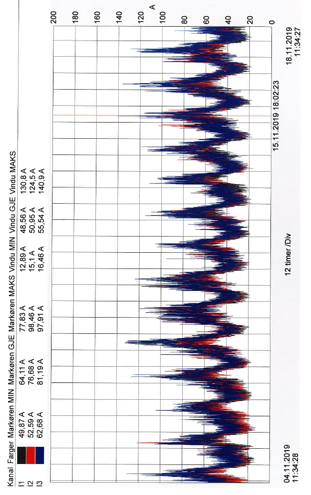
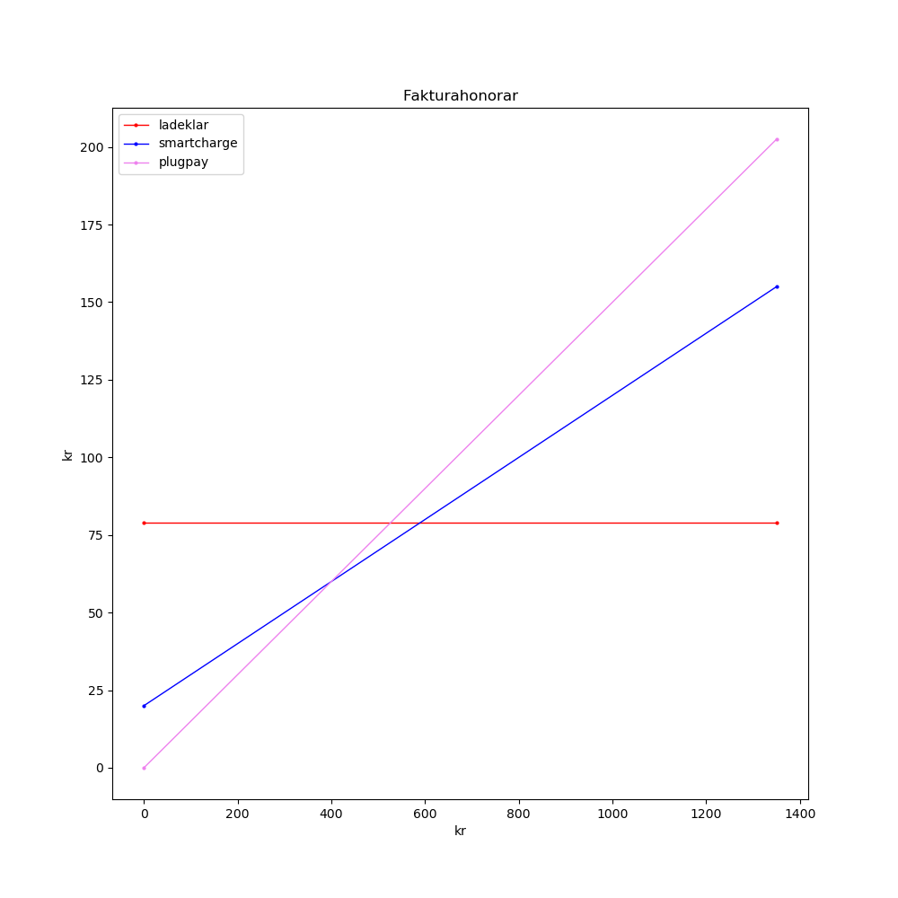

 1. Innledning
==============

I beboermøtet april 2019 inviterte styret interesserte beboere til å delta i ei gruppe
for å utrede hvordan borettslaget kan løse det økende behovet for ladeplasser or el-bil.

Følgende beboere meldte seg til arbeidet:

(Red.anm: I nettutgaven av dokumentet er etternavn er foreløpig utelatt av personvernshensyn.)

* Kirsti M.
* Andeas Nordal
* Trond T.
* Paul H.

Styret oppnevnte Øyvind R. til å lede arbeidet.

Arbeidsgruppa har hatt xxx møter. Det er innhentet dokumentasjon som formelt rammeverk,
måling av kapasitet, kostnader og behov.

Gruppa skisserer tre mulige modeller for at alle med parkeringsrett i parkeringshus kan tilbys
lading av el-biler i parkeringshus. I tillegg skisseres mulig løsninger for lading på
uteparkeringsplassen.

Modeller for lading i parkeringshus:

1. xxx
2. xxx
3. xxx

Skisse løsning for lading på uteparkeringsplassen:

 2. Mandat
==========

1. Arbeidsgruppa skal lage en oversikt over muligheter for å tilby lading av El-kjøretøy
2. Arbeidsgruppa skal presentere mulige løsninger for lading av El-kjøretøy i
borettslagets parkeringsanlegg
3. Arbeidsgruppa skal undersøke muligheter for ekstern finansiering av ladeløsninger
4. Arbeidsgruppa skal foreslå modeller for beboer/brukerbetaling av ladeløsninger
5. Arbeidsgruppa leverer sitt forslag til styret før beboermøtet våren 2020

I styremøte presiseres det at mandatet gjelder el-biler, og at spørmålet om ladeplasser
utendørs muligens bør utredes særskilt.

 3. Formelle rammer
===================

- Lover og forskrifter
- Vedtekter og husordensregler
- Kapasitet
- Finansiering

 4. Gjeldende ordning
=====================

 5. Problemstillinger
=====================

Etterspørsel
------------

Hvor mange vil ha elbillader, som funksjon av pris?

Ledig kapasitet
---------------

Vi har 3 tavler.

### Tavle 53

> Total kapasitet er 3·500A.
> Målt maksforbruk 3·160A.
> Ledig kapasitet til elbil er 3·340A, 135kW, som utgjør 36 ladestasjoner på 16A 3,7kW.

### Tavle 69

> Inntakssikeringene er 315A.
> Vi målte høyeste forbruk på 141A.
> Da er det en maks ledig kapasitet på 174A, som blir 69kW.
> Det kan da gi strøm til 18 ladestasjoner på 3,7kW.
> Det kan installeres et styringssystem i hver tavle hvor all ledig kapasitet går til elbiler.

Protokoller for lastbalansering og forbruksmåling
-------------------------------------------------

* OCPP er en etablert åpen standard som støtter alt vi strengt tatt trenger.
  - De fleste produsenter (Ensto, Garo, Salto, Schneider, Zaptec) har ladere som støtter OCPP.
  - Ingen begrensning på antall ladere som kan tilknyttes.
  - Støtter ikke dynamisk fasebalansering (det er det visstnok bare Zaptec som har, ifølge dem selv).
  - Støtter statisk ladeprofil som en ukentlig timeplan.
  - Ved nettverksfeil mister man den dynamiske biten av lastbalanseringa. Derfor viktig med en konservativ statisk ladeprofil i bunnen.
  - Sentralenheten kan kjøpes fra flere produsenter eller som en skybasert tjeneste.
* Salto og Garo tilbyr også lastbalansering basert på Modbus over RS485.

Innfase 400V TN?
----------------

(Dette punktet gjør seg gjeldende hvis vi enten *må* oppgradere strømnettet på noen måte,
eller hvis vi *risikerer* å måtte gjøre det i nær framtid.)

* IT-nett er av flere grunner suboptimialt for elbillading.
  * Ladeplugg type 2 på IT-nett må kobles med en av faselederne på nøytral, noe som neppe er i tråd med spekken. TN-nett er utvilsomt mindre problematisk i lengden.[2]
  * Høyere spenning = høyere effekt.
  * Merk at 230V like lett kan tas fra et 400V TN-nett, slik de gjør det i resten av Europa (det er bare snakk om hvilket ledningspar man tar fra). Så det er ikke noe i veien for å ta med et eksisterende 230V-nett i en slik oppgradering.
* Å oppgradere ladernes strømnett til 400V *i ettertid* vil kreve omkobling av hver lader.

Ønsker vi f.eks. 3-fase-lading ute? Det vil kreve et TN-nett.

Det å få enda en transformator der ute kan tenkes å falle inn under *anleggsbidrag*.[1]
Se forøvrig kost/nytte-beregninger med oppgradering til TN-nett.[2]

Hva gjør vi med dagens ladere på vaskeristrøm?
----------------------------------------------

Skal disse
1. Innlemmes i nytt kontrollsystem for lastbalansering og/eller forbruksmåling?
   - Dagens ladere er av type «Wallbox eMH1»[3], merket Salto og Abl. Dette er hjemmeladere som ikke er egnet for dynamisk styring og lastbelastning for mer enn 6 enheter/ladebokser. Det skulle bety at alle ladebokser av denne typen må byttes ut hvis de skal være en del av et felles anlegg for hele garasjen.
2. Få fortsette å operere uregulert i overskuelig framtid?
   - Med gulrot for oppgradering til lader som *kan* innlemmes?
3. Utfases?

Er vaskeristrømmen 1 eller 3 faser?
Evt. skjevlast blir urettferdig for de som lastbalanseres på samme fase.
Det er da man trenger dynamisk fasebalansering.
Se også skjevspenning.[1]

Leverandører av ladeinfrastruktur
---------------------------------

Fra «Bergheims Ladepunkter»:[4]

* Salto (OCPP): https://www.salto.no
* Ensto (OCPP): https://www.ensto.no
* Schneider (OCPP) https://www.schneider.no
* Zaptec (Proprietær) https://www.zaptec.no
* Garo (OCPP) https://www.garo.no
* EV-boks (Proprietær) https://www.ev-box.com

Leverandører av betalingstjenester
----------------------------------

Mange av ladeleverandørene ovenfor legger opp til at borettslaget besørger avlesing og kostnadsfordelig selv.
Zaptec er intet unntak:[5]

> Borettslag og sameier kan kostnadsfritt og enkelt hente ut ladehistorikk fra ZAPTEC Portal
> og fakturere den enkelte beboer som har brukt strøm til å lade elbilen.
> Dette er enkleste og rimeligste løsning for rettferdig fordeling av strømforbruket.

Borettslaget står her fritt til å sette priser etter egen fantasi.
Det andre alternativet er å sette bort jobben til en «betalingstjeneste».[5]
Da er tilgjengelige priskriterier begrenset til de måledata som er tilgjengelige i ladehistorikken
og hva den enkelte tjenesten legger opp til – altså fortsatt stort rom for kreativitet.
For eksempel skriver Charge365:[6]

> Løsningen gjør det mulig å motta betaling for strømforbruk, tidsforbruk, månedsgebyr,
> forskjellige priser på døgnet, forskjellige priser i samme lading
> f.eks 2 timer gratis, så kr 30,- pr. time, flåtestyring, evt. delbetaling av ladeutstyr mm.

I tillegg kommer fakturahonoraret som betalingstjenesten skal ha til seg selv.
Dette honoraret er det ikke mange som oppgir, men de som gjør det er ikke billige.
Her kan det med fordel innhentes flere tilbud,
men foreløpig inntrykk er at dette ville utgjøre en betydelig driftskostnad,
og at fakturaforfatterskap må være en gjevt betalt deltidsjobb, selv uten automatisering.

Hvis dette kan tenkes å bli billigere, kan det være et poeng at betalingstjenesten
ikke er bundet til den investerte ladeinfrastrukturen – konkurranseutsetting.

Tilbud:

* Hafslund Ladeklar: 79 kr/mnd (ikke helt sammenlignbart, da de tar hele investeringa på ladeinfrastruktur)
* SmartCharge: 20 kr/mnd + 10% av fakturagrunnlaget[7]
* PlugPay: 15% av fakturagrunnlaget[8]

Diagrammet stopper ved 1350 kr, da dette antas å være en praktisk
grense for hvor mye penger det er mulig å lade for per måned.
Det er det det koster å henge på laderen 12 timer i døgnet, 7 dager i uka
med en ladeeffekt på 3,7 kW og en strømpris på 1 kr/kWt:

    1 kr/kWt · 3,7 kW · 12 t/døgn · 30,44 døgn/måned ≈ 1351,5 kr/måned

Med dette forbruket kan man dagpendle Oslo – Lillehammer (hvis man riktignok også lader i andre enden).
Poenget er å antyde hvilken ende av diagrammet de fleste kommer til å ligge i.

Finansiering
------------

Arbeidsgruppa foreslår som rettferdighetsveiledning at
felles investeringer betales av de som får glede av dem.

Basert på dette prinsippet foreslås følgende nyanseringer:

* Ladere som monteres på plasser som følger en andelsleilighet anses som en investering i andelsleiligheten (på linje med vannklosett) som dessuten vil være frivillig. ⇒ Betales av andelseier.
* Infrastrukturoppgradering, være seg av garasjeanlegg eller parkeringsplass: I den grad dette er en langsiktig investering, med håp om å tilfredsstille ønsket kapasitet for ladeplasser i overskuelig framtid, er dette en felles investering i det respektive området. ⇒ Fordeles på berørte plasser (selvsagt med få unntak).
  - Hvis eksisterende ladere skal skiftes ut, er disse plassene intet unntak. Det vil være beklagelig at disse andelseierne skal betale for noe de har kjøpt før; like beklagelig som at løsninga tydeligvis var for kortsiktig, slik at disse sitter med eksklusiv ladetilgang i dag.

---

Siden vi allerede har nok strøm til alle garasjeplasser fra vaskeristrømmen (hvis det er riktig),
trenger vi i det hele tatt finansiere noe annet enn dynamisk styring og lastbalanse???
Så kan styret kreve at nye ladebokser er tilpasset dette,
og at garasjeeierene selv betaler for kabler og tilkobling, slik det er gjort til nå?
Dette var bare en tanke rundt hva som kan kreves av klargjøring for lading av el-bil.
Kirsti (red.anm) ser det ikke som hensiktsmessig med et utall av kabler i garasjen
og har noen spørsmål om finansiering nedenfor!

1. Hvordan skal klargjøring for ev. montering av egne ladebokser finansieres? Vi bør få noen prisoverslag før vi drøfter dette.
   - Skal garasjeeiere spleise på utgiftene til dette? Kan vi i så fall kreve at ev.
garasjeeiere som ikke ønsker klargjort for ladestasjon på sin garasjeplass, skal være
med på finansieringen nå? Er det i så fall rettferdig at garasjeeierne skal være med å
betale for klargjøring av lading ute når det kommer?
   - Skal borettslaget finansiere all klargjøring i garasjene? Er det i så fall rettferdig at de som ikke har garasjeplass skal være med å betale dette?
2. Hvordan skal ev. bytte av ladebokser for allerede monterte ladere finansieres?
   - Må finansieres av borettslaget som helhet, da det er satt opp i samsvar med krav fra borettslaget.
   - Delfinansieres av garasjeeier. Kostnader ved montering av dynamisk styring og lastbalanse er det rimelig at de som allerede har ladeboks, betaler sin andel av.

Lenker
======

* [1] [https://dev-hafslundnett.no/artikler/kunde/flere-detaljer-om-elbil-og-lading/LyVgmpv8eAwU2UawKeEGk](https://dev-hafslundnett.no/artikler/kunde/flere-detaljer-om-elbil-og-lading/LyVgmpv8eAwU2UawKeEGk)
* [2] [http://publikasjoner.nve.no/eksternrapport/2019/eksternrapport2019_07.pdf](http://publikasjoner.nve.no/eksternrapport/2019/eksternrapport2019_07.pdf)
* [3] [https://www.ablmobility.de/en/products/emh1.php](https://www.ablmobility.de/en/products/emh1.php)
* [4] [https://www.miljokommune.no/Global/Klima/Webinarer/Ladepunkter%20Bergland.pdf](https://www.miljokommune.no/Global/Klima/Webinarer/Ladepunkter%20Bergland.pdf)
* [5] [https://zaptec.com/betalingstjenester/](https://zaptec.com/betalingstjenester/)
* [6] [https://www.charge365.no/betalingslosning-ladelosning-elbil](https://www.charge365.no/betalingslosning-ladelosning-elbil)
* [7] [https://meshcrafts.com/smartcharge-zaptec/?lang=no](https://meshcrafts.com/smartcharge-zaptec/?lang=no)
* [8] [https://www.plugpay.no/eiere-av-zaptec-anlegg/](https://www.plugpay.no/eiere-av-zaptec-anlegg/)
